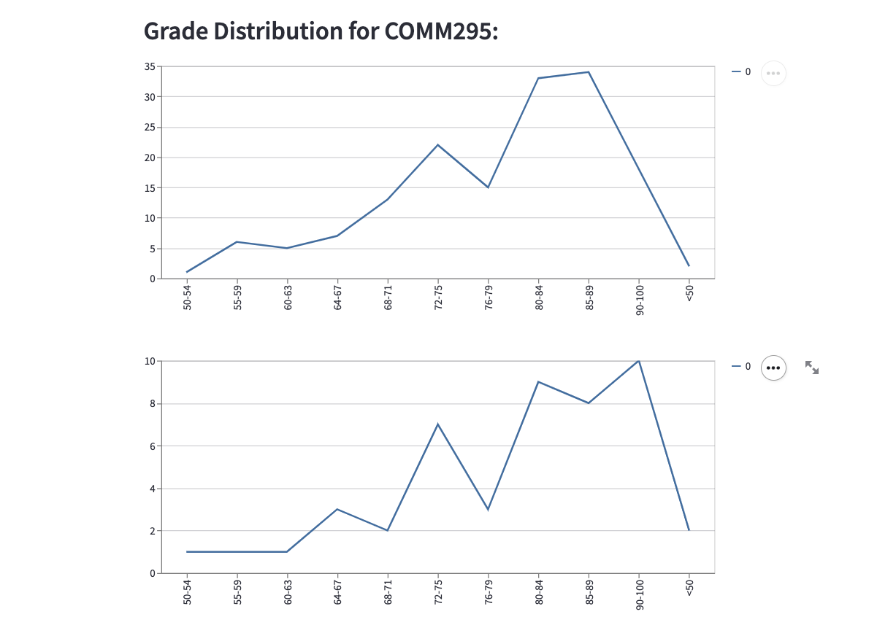
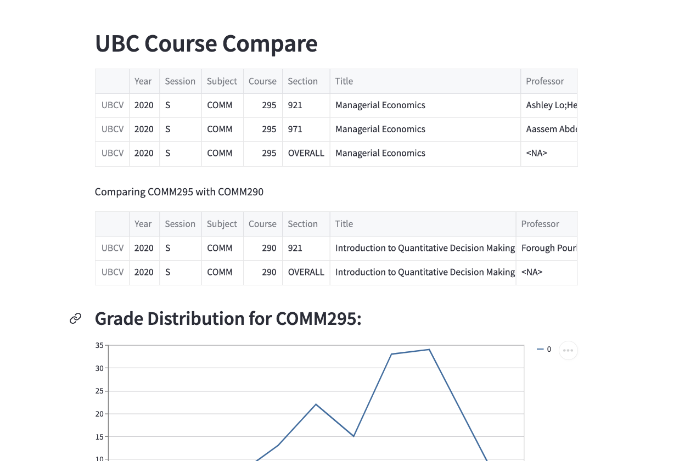

# How to Use
``` git clone https://github.com/akshayubc/ubc-course-compare.git```
1. Install dependencies [requirements.txt]
2. Move to main.py directory and run: <br>
```streamlit run main.py```

# What's special
1. Compare courses visually


2. Faster Data retrieval than UBC PAIR Grade Distribution

3. Makes it easier to compare courses based on important metrics.



Special Thanks to github user DonneyF for easier data access.


